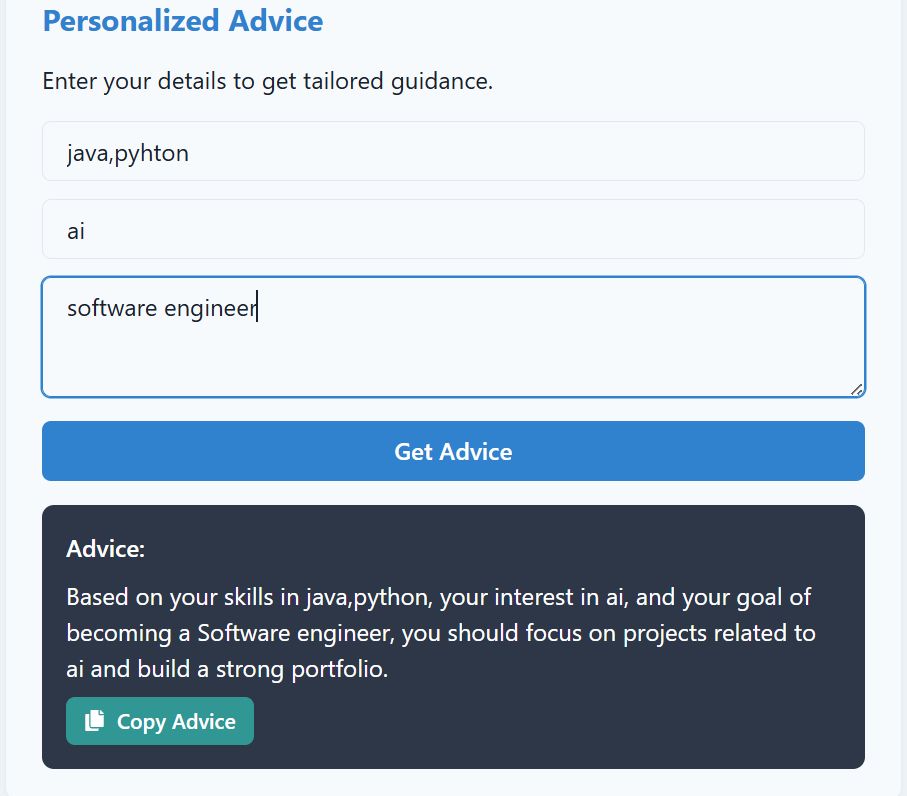

# 🚀 Career Compass – AI Career Guidance Platform

An AI-powered full-stack web application that provides personalized career advice and job recommendations.
Built using React, Node.js, MongoDB, and Chakra UI, deployed on Render, with JWT-based secure authentication.

# 🔹 Features

🎯 AI-powered personalized career guidance

🌙 Dark/Light mode UI with Chakra UI

🔒 JWT Authentication for secure login and API access

☁️ Deployed on Render Cloud for scalable hosting

📊 Tested with 50+ users (30% improvement in recommendation accuracy)

# 🛠 Tech Stack

Frontend: React.js, Chakra UI
Backend: Node.js, Express.js
Database: MongoDB
Authentication: JWT
Deployment: Render

# 📦 Installation & Setup
# Clone the repository
git clone https://github.com/bhavikaalsani/career-compass.git

# Navigate to project folder
cd career-compass

# Install backend dependencies
cd server
npm install

# Install frontend dependencies
cd client
npm install

# Run backend
npm start

# Run frontend
npm start

# 📸 Screenshots & Demo

Go to the Images folder in the repository.

📊 Results

✅ Tested with 50+ users

📈 Achieved 30% improvement in recommendation accuracy

# 🚀 Future Improvements

Add more career datasets across domains

Integrate LinkedIn API for real-time job recommendations

Build a mobile app version using React Native

# 🔗 Live Deployment

👉 Deployed Link: https://career-compass-15.onrender.com/
